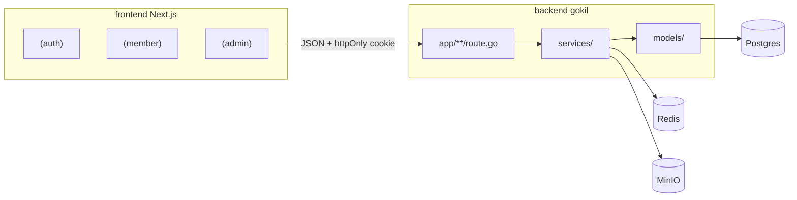

# DESIGN.md — MyOrganizations System

Dokumen ini menerjemahkan [`PRD.md`](PRD.md) menjadi keputusan arsitektur konkret: stack, pemisahan aplikasi, pemetaan entitas domain, batasan framework, model permission, background jobs, storage, dan roadmap pengembangan.

Panduan kerja AI agent: [`AGENTS.md`](AGENTS.md), [`CLAUDE.md`](CLAUDE.md).

## 0. Stack & Runtime

| Lapisan | Teknologi | Lokasi |
|---|---|---|
| API | Go 1.26 + **[gokil](https://github.com/lrndwy/gokil)** (`github.com/lrndwy/gokil`) | [`backend/`](backend/) |
| UI | Next.js 16 + React 19 + Tailwind v4 + **shadcn/ui** style `base-mira` (`@base-ui/react`) | [`frontend/`](frontend/) |
| DB | PostgreSQL 16 | Docker Compose `backend/docker-compose.yml` |
| Cache / session support | Redis 7 | sama |
| Object storage | MinIO (S3-compatible) | ditambahkan ke docker compose; provider gokil `s3` |

**Framework backend:** gokil adalah framework buatan sendiri (file-based routing ala Next.js + pola Django-like: settings, models, migrations, cron). Repo: <https://github.com/lrndwy/gokil.git>. Versi awal proyek: `v0.8.1`; setelah patch Fase 0 → bump ke `v0.9.0+` (lihat §0.1 dan §13).

**Desain UI:** seluruh tampilan memakai komponen shadcn yang sudah terpasang / ditambahkan lewat CLI. Preset `base-mira` + token CSS di [`frontend/app/globals.css`](frontend/app/globals.css) adalah **satu-satunya** sumber warna/radius. Tidak menambah palette custom di luar token tersebut. Field `theme` di settings = appearance mode (`light` / `dark` / `system`).

Blok shadcn yang sudah di-install:
- `npx shadcn@latest add login-02` → `components/login-form.tsx`, `app/login`
- `npx shadcn@latest add signup-02` → `components/signup-form.tsx`, `app/signup`
- `npx shadcn@latest add sidebar-08` → `components/app-sidebar.tsx`, `nav-*`, `app/dashboard`

### 0.1 Batasan gokil v0.8.1 & Patch yang Diperlukan

Diverifikasi dari source `gokil@v0.8.1`. Agent **wajib** mengikuti aturan workaround sampai patch di-merge.

| Masalah | Dampak | Aturan / Patch |
|---|---|---|
| `models.Query/Create/Save/Delete` race (`gid()` selalu 0) | Concurrent request saling menimpa DB context | **Larang** `models.*` di handler. Pakai `orm.Objects[T](ctx.Request.Context())` / `orm.Create` / `orm.UpdateByID`. Patch: perbaiki `gid()` di upstream. |
| `orm.WithTx` tidak memasang `*Tx` ke context | Approval & counter surat tidak atomik | Sampai patched: transaksi kritis via `db.BeginTx` + raw SQL pada `*sql.Tx`. Patch: panggil `withTxContext`. |
| Tidak ada per-route middleware | Permission check mudah terlewat | Fungsi eksplisit `permission.Require(ctx, "code")` di awal setiap handler. Patch: `RegisterRoute` + middleware chain. |
| Tidak ada auth / RBAC / validation bawaan | Harus dibangun di project | Implement di `backend/internal/...` atau `backend/pkg/...`. |
| Tidak ada helper multipart | Upload file | `ctx.Request.FormFile` + `storage.Provider`. Patch: helper di `views.Context`. |
| Tidak ada `SELECT FOR UPDATE` / composite unique via ORM | Counter surat & unique attendance | Migration SQL manual + raw SQL `FOR UPDATE`. Patch opsional: `QuerySet.ForUpdate()`. |
| Envelope bawaan ≠ kontrak PRD | Frontend bingung | Wrapper response proyek (`success` / `message` / `data` / `errors`). Patch: samakan envelope di gokil. |
| `ctx.DB()` selalu nil | Jangan dipakai | Ambil DB dari `orm.DBFromContext(ctx.Request.Context())`. Patch: samakan context key. |
| Cron hanya `Every time.Duration` | Scheduler event status | Job interval 1 menit (cukup). Set `Logger` / `OnError` eksplisit. Tidak ada distributed lock — 1 proses cron. |
| Migration hanya deteksi ADD COLUMN; Postgres-only | Perubahan skema kompleks | Tulis SQL manual di `migrations/` bila perlu DROP/ALTER/INDEX. |
| Router linear; method mismatch → 404 | `/users/me` vs `/users/:id` | Letakkan path statis agar terdaftar sebelum dinamis; regenerate routes. |
| Docs gokil menyebut API yang belum ada | Compile error jika diikuti | Percaya source & proyek ini, bukan `docs/views/*.md` gokil yang usang. |

**Prasyarat Fase 0** (repo terpisah `~/MyProjects/gokil`): fix `gid`, fix `WithTx`, per-route middleware, multipart helpers, `ctx.DB`, envelope `success/message/errors`, panic recovery + CORS + access log, opsional `ForUpdate`. Tag `v0.9.0`, bump `backend/go.mod`.

## 1. Arsitektur Aplikasi

Dua deployable yang berbagi kontrak API:

| Deployable | Pengguna | Fungsi utama |
|---|---|---|
| **`frontend/`** (Next.js) | Anggota + admin (satu app) | Auth UI, dashboard anggota, panel `/admin/*` |
| **`backend/`** (gokil API) | Frontend (+ klien lain) | Auth, business logic, storage, notifikasi, scheduler |

Di dalam frontend, pengalaman dipisah dengan **route groups** (bukan dua app terpisah):

| Group | URL | Shell |
|---|---|---|
| `(auth)` | `/login`, `/register`, `/recruitment/:slug` | Layout auth (blok login-02 / signup-02) |
| `(member)` | `/dashboard`, `/profile`, `/events`, … | Sidebar (sidebar-08) + menu anggota |
| `(admin)` | `/admin/...` | Sidebar yang sama; item menu difilter permission |

**Login terpusat:** UI auth hanya di `/login`. Akses ke `/admin/*` tanpa session mengalihkan ke `/login?next=/admin/...`.



### 1.1 Struktur direktori target

```
MyOrg-v2/
  PRD.md
  DESIGN.md
  AGENTS.md
  CLAUDE.md
  backend/
    app/                 # file-based routes → register.go (generated)
    cmd/backend/main.go
    models/
    services/            # business logic (bukan di handler)
    internal/            # auth, permission, response, storage wiring
    jobs/cron.go
    migrations/
    storage/             # local fallback path (prod pakai MinIO)
    docker-compose.yml   # postgres, redis, minio
    settings.go
  frontend/
    app/
      (auth)/login|register|recruitment/...
      (member)/dashboard|profile|events|...
      (admin)/admin/...
    components/          # shadcn ui + forms + app-sidebar
    lib/                 # api client, auth helpers, utils
    hooks/
```

**Layer backend:** `route.go` (bind/response + panggil service) → `services/` (logic) → `models/` + `orm` / raw SQL. Jangan taruh approval, counter surat, atau cron logic di handler.

## 2. Domain Model → Entity Mapping

Setiap tabel di PRD §4 dipetakan ke model Go yang embed `orm.BaseModel` (`ID int64`, `CreatedAt`, `UpdatedAt`). Urutan implementasi mengikuti dependency.

### 2.1 Division
| Field | Tipe | Catatan |
|---|---|---|
| `name` | string | |
| `description` | text | tugas pokok & fungsi |

### 2.2 Role & Permission (custom RBAC, lihat §5)
**Role:** `name` unique, `description` optional, `is_system` boolean (true untuk Admin bawaan).

**Permission:** `code` unique (e.g. `events.create`), `module`, `description` optional.

**RolePermission:** junction M2M `role_id` + `permission_id` — `UNIQUE(role_id, permission_id)` via migration manual.

### 2.3 User
| Field | Tipe | Catatan |
|---|---|---|
| `username` | string, unique | login identifier utama |
| `email` | string, unique | |
| `password_hash` | string | bcrypt |
| `full_name` | string | |
| `birth_date` | date, optional | |
| `hometown` | string, optional | |
| `phone` | string, optional | |
| `avatar_url` | string, optional | URL MinIO |
| `division_id` | FK → divisions | |
| `role_id` | FK → roles | |
| `status` | enum | `active` \| `inactive` \| `deleted` |

Auth login: **username** (utama) dan email (fallback).

### 2.4 OrganizationSettings
Singleton (max 1 row). Service menolak create kedua (409); delete dinonaktifkan.

| Field | Tipe |
|---|---|
| `web_name`, `logo_url`, `icon_url` | string |
| `theme` | `light` \| `dark` \| `system` |
| `allow_self_register`, `allow_cross_division_events_view` | boolean |

Admin UI: `/admin/settings` (form singleton), bukan CRUD list.

### 2.5 Event
`title`, `location`, `description`, `division_id` nullable (null = General), `banner_url`, `start_time`, `end_time`, `allow_permission`, `status` (`upcoming` \| `ongoing` \| `finished` \| `cancelled`), `created_by`.

### 2.6 Attendance
`event_id`, `user_id`, `status` (`present` \| `permitted` \| `absent` \| `rejected`), `selfie_url`, `signature_url`, `checked_in_at`.  
**UNIQUE `(event_id, user_id)`** — migration SQL manual (ORM tidak generate composite unique).

### 2.7 PermissionRequest (Perizinan)
`event_id`, `user_id`, `reason`, `proof_url`, `status`, `reviewed_by`, `review_note`, `reviewed_at`.

### 2.8 Violation
`user_id`, `issued_by`, `violation_type`, `sp_level`, `description`, `document_url`, `issued_date`.

### 2.9 Recruitment
**Recruitment:** `title`, `description`, `slug` unique, `open_date`, `close_date`, `status`.

**RecruitmentTargetDivision**, **RecruitmentCustomField** (`field_options` sebagai `json.RawMessage` + tag `orm:"type:json"`), **RecruitmentSubmission** (`custom_answers` JSON; `nim` legacy).

### 2.10 Letter
**LetterCategory:** `name`, `code`, `start_number`, `current_number`, `number_format_template`.

**LetterTemplate / Letter:** sesuai PRD; outgoing merge `.docx`; incoming upload + parse/OCR.

Placeholder: `{NOMOR_SURAT}`, `{NAMA_ORGANISASI}`, … Alias legacy `{NOMOR}` / `{LETTER_CODE}`.

### 2.11 Announcement
`title`, `content`, `target_type`, `target_division_id`, `publish_date` + attachments inline di form.

### 2.12 Keuangan (Bendahara)
**FinanceCategory**, **FinanceTransaction** — permission `finance.*`. Endpoint summary/dashboard kustom.

**Wallet** (sumber dana: kas tunai, rekening bank, e-wallet):

| Field | Tipe | Catatan |
|---|---|---|
| `name` | string | wajib |
| `description` | text | opsional |
| `initial_balance` | float | saldo awal |
| `is_active` | boolean | wallet nonaktif disembunyikan dari form transaksi |

`FinanceTransaction.wallet_id` nullable FK → wallets (`ON DELETE SET NULL`). Saldo wallet = `initial_balance` + pemasukan − pengeluaran (dihitung service, bukan kolom). Endpoint: `GET/POST /wallets`, `PUT/DELETE /wallets/:id`; saldo per wallet ikut di `GET /finance_transactions/dashboard`. Permission: `finance.view` (lihat), `finance.wallets.manage` (kelola). Wallet dengan transaksi tidak bisa dihapus.

### 2.13 Catatan ORM
- Relasi: `orm.BelongsTo`, `orm.HasMany`, `orm.ManyMany` (FK `int64`).
- Field JSON: `json.RawMessage` + `type:json` (bukan `map[string]any` mentah).
- Tambahkan `json` tags pada model/DTO agar API tidak mengekspos `Author.Ref` / PascalCase mentah bila diperlukan.
- Hindari `models.Save` pada instance baru (bisa jadi UPDATE `WHERE id = 0`); pakai `orm.Create`.

## 3. Endpoint Publik (di luar auth)

| Endpoint | Auth | Catatan |
|---|---|---|
| `GET /settings` | Public | Subset branding: `web_name`, `logo_url`, `icon_url`, `theme` |
| `GET /public/recruitment/:slug` | Public | Form recruitment |
| `POST /public/recruitment/:slug/submit` | Public | Submission tanpa login |

## 3.1 Catatan path API vs PRD

Package Go tidak mendukung hyphen di nama folder. Beberapa endpoint memakai **underscore**:

| PRD (hyphen) | Implementasi |
|---|---|
| `/permission-requests` | `/permission_requests` |
| `/attendance/permission-requests` | `/attendance/permission_requests` |
| `/letter-categories` | `/letter_categories` |
| `/finance-transactions` (jika ada) | `/finance_transactions` |

Frontend harus memanggil path underscore.

## 4. Endpoint Kustom (di luar CRUD standar)

| Endpoint | Auth | Catatan |
|---|---|---|
| `PUT /settings` | `settings.manage` | Multipart logo/icon |
| `GET /me`, `PUT /me`, `PUT /me/password` | Auth | Profile |
| `GET /me/permissions` | Auth | Daftar permission code untuk gating sidebar |
| `GET /events/:id/recap` | `events.view` | Aggregasi + export |
| `POST /events/:id/attendance` | `attendance.submit` | Selfie + signature |
| `GET/PUT /attendance/permission-requests/*` | `attendance.approve` | Approval |
| `POST /permission-requests`, `GET /permission-requests/me` | `permission.submit` | Ajukan & riwayat |
| `GET /users/import/template`, `POST /users/import` | `users.import` | Bulk import |
| `GET /roles/:id/permissions`, `PUT /roles/:id/permissions` | `roles.edit` | Matrix replace-all |
| `POST /letters/parse-incoming` | `letters.manage` | Preview parse |
| `GET /letter_templates/:id/variables` | `letters.manage` | Placeholder `.docx` + metadata format nomor |
| `POST /letter_categories/:id/preview-number` | `letters.view` | Preview nomor surat dengan segmen dinamis |
| `GET /backups`, `POST /backups/generate`, restore, download | System admin | Backup |
| `GET/POST/DELETE /push/subscribe` | Auth | Web Push |

## 5. Model Role & Permission (Custom RBAC)

| Layer | Fungsi |
|---|---|
| **System admin** (`roles.is_system` / flag setara) | Gate panel admin tooling (backup, maintenance) |
| **Custom Role + Permission** | Gate fitur bisnis: `events.create`, dll. |

**Check di handler** (sampai per-route middleware gokil siap):

```
function RequirePermission(ctx, code):
  user = currentUserFromJWT(ctx)
  if not userHasPermission(user.role_id, code) and not isSystemAdmin(user):
    return 403
```

Permission awal: `settings.manage`, `users.view/create/edit/delete/import`, `roles.view/create/edit/delete`, `events.view/create/edit/delete`, `attendance.submit/approve`, `divisions.view/create/edit/delete`, `permission.submit`, `violations.view/manage`, `recruitment.manage`, `letters.view/manage`, `announcement.create`, `finance.view/create/edit/delete/categories/manage`, `finance.wallets.manage`, `storage.view/upload/delete/manage`.

Role **Bendahara** seed: semua `finance.*`.

**Admin UI gating:** sidebar filter dari `GET /me/permissions`. System admin bypass permission bisnis.

## 6. Business Logic Kunci (Service Layer)

Semua logic non-trivial di **`services/`**, bukan di `route.go`.

### 6.1 Event Status Transition
Cron job tiap 1 menit (`jobs/cron.go`):
- `upcoming → ongoing` saat `now >= start_time`
- `ongoing → finished` saat `now >= end_time`

Jalankan sebagai proses terpisah: `go run ./cmd/backend cron`. Set `Logger`/`OnError`. Satu instance saja (tidak ada distributed lock).

### 6.2 Absensi & Perizinan
- Absensi hanya jika `event.status == 'ongoing'`.
- Upload selfie & signature ke MinIO; simpan **URL** di DB.
- Approval: update `permission_requests` + `attendances` dalam **satu transaksi** (`*sql.Tx` + raw SQL sampai `WithTx` di-patch).

### 6.3 Generate Kode Surat & Dokumen Outgoing
1. Ambil template + kategori.
2. `BEGIN`; `SELECT ... FOR UPDATE` pada kategori; hitung nomor dari `current_number` / `start_number`.
3. Render `number_format_template` → `letter_code`:
   - **Placeholder sistem (auto):** `{number}` (default 3 digit: 001, 002, …), `{number:N}` (zero-pad eksplisit), `{code}`, `{month_roman}`, `{year}`, alias `{nomor}`, `{letter_code}`. Gunakan `{number:0}` untuk nomor tanpa zero-pad.
   - **Placeholder custom (input per surat):** segmen dinamis seperti `{unit}`, `{tujuan}` — wajib diisi di form surat keluar; nilai disimpan di `variable_values`.
   - **Teks literal** di template (mis. `HIMATRIS`) tetap statis per kategori.
   - Contoh kategori `SPm-i` + template `{number:3}/{code}/{unit}/HIMATRIS/{month_roman}/{year}` → `001/SPm-i/PAN-Stuband/HIMATRIS/VII/2026`.
   - Override manual `letter_code` diizinkan; counter tetap increment.
4. Simpan letter + `variable_values` (JSON) — dipakai untuk nomor dan merge `.docx`.
5. Merge `.docx` → upload MinIO → `document_url`.
6. Preview nomor: `POST /letter_categories/:id/preview-number` body `{ segments: { "unit": "..." } }`.
7. Incoming: upload saja (tanpa merge); kategori internal `SM-IN` bila berlaku.

### 6.4 Role Permission Matrix
`GET` → semua permission + `assigned_ids`.  
`PUT` body `{permission_ids: []}` → replace-all dalam transaksi.

### 6.5 Notifikasi
Job async (nanti Redis/queue jika perlu): email kredensial import, hasil approval izin, announcement + Web Push.  
Model `PushSubscription`: `user_id`, `endpoint` unique, `p256dh`, `auth`.

### 6.6 Visibility Divisi
```
if user lacks "events.view_all" AND settings.allow_cross_division_events_view == false:
  filter events where division_id = user.division_id OR division_id IS NULL
```

### 6.7 Organization Settings Singleton
Service enforce max 1 row.

### 6.8 User Import
Parse CSV/XLSX → validasi → bulk insert → email async.

### 6.9 Auth
- Password: bcrypt.
- Login sukses: terbitkan JWT; set cookie httpOnly `token` + kembalikan `token` di body (PRD §5.1).
- Middleware/global hook: baca cookie atau `Authorization: Bearer`.
- Rate-limit `/auth/login` dan `/public/recruitment/*` (implementasi proyek; Redis opsional).

## 7. Seed Data

- 1 user Admin + role `Admin` (`is_system: true`, semua permission).
- Daftar `permissions` lengkap §5.
- 1 row `organization_settings` (`theme: system`).
- Contoh `letter_categories` (`UND`, `SK`).
- Divisi demo.

**Production:** password admin kuat via env; tolak default dev.

## 8. Penyesuaian Manual (di luar auto-migration ORM)

1. Unique composite `(event_id, user_id)` di `attendances`.
2. Unique `(role_id, permission_id)` di `role_permissions`.
3. Kolom JSON + index tambahan sesuai kebutuhan report.
4. Middleware/global CORS, recovery, access log (atau tunggu patch gokil).
5. Endpoint publik recruitment & settings.
6. Service counter surat + merge dokumen + OCR.
7. Scheduler status event.
8. Hapus model demo scaffold (`Post`, `Tag`) sebelum domain model.

## 9. File Storage (MinIO / S3)

Provider: `GOKIL_STORAGE_PROVIDER=s3` dengan endpoint MinIO. Layout:

```
uploads/{YYYY}/{MM}/{timestamp}-{filename}
thumbnails/{YYYY}/{MM}/...
avatars/{user_id}/{timestamp}.jpg
attendance/selfies/{event_id}/{user_id}.jpg
attendance/signatures/{event_id}/{user_id}.png
permissions/proofs/{permission_request_id}.{ext}
violations/documents/{violation_id}.{ext}
recruitments/{recruitment_id}/attachments/...
letters/{letter_id}/generated.docx
letter-templates/{template_id}/template.docx
announcements/{announcement_id}/{filename}
settings/logo.{ext}
settings/icon.{ext}
backups/{date}-{id}.zip
```

- Validasi MIME & ukuran di service sebelum upload.
- Admin: manajemen file organisasi (folder virtual) — permission `storage.*`.
- Web anggota: tidak ada halaman storage terpisah.
- Wiring: `storage.New(settings.Storage)` sekali di bootstrap; jangan `NewS3` per request.

## 10. Keamanan & Observability

- Rate-limit endpoint publik & login.
- Monitor: `events/:id/recap`, `users/import`.
- Validasi upload di service.
- JWT secret & kredensial MinIO/DB hanya di env (jangan commit `.env`).
- CORS mengizinkan origin frontend.

## 11. Non-Goals

- Tidak ada mobile app native di fase awal.
- Tidak multi-tenant (1 deployment = 1 organisasi).
- Tidak menambah design system di luar shadcn `base-mira`.
- Tidak ada fitur demo/blog di luar PRD.

## 12. Keputusan Desain (ringkas)

| Topik | Keputusan |
|---|---|
| Framework API | [gokil](https://github.com/lrndwy/gokil) — dokumentasikan & patch upstream |
| Primary key | `bigint` / `int64` identity (bukan UUID) |
| Frontend | Satu app Next.js, route groups `(auth)` / `(member)` / `(admin)` |
| UI kit | shadcn/ui preset `base-mira` saja |
| Theme settings | Appearance mode light/dark/system |
| Login identifier | Username utama; email fallback |
| Auth | JWT + httpOnly cookie (+ token di body) |
| Dual role | System admin + custom Role/Permission |
| File upload | MinIO (S3) + URL di DB |
| Organization settings | Singleton |
| Transaksi kritis | `*sql.Tx` + FOR UPDATE sampai WithTx patched |
| ORM access | `orm.*` + request context; larang `models.*` scaffold |

## 13. Roadmap Pengembangan

### Fase 0 — Patch gokil (repo `~/MyProjects/gokil`)
- Fix `gid()`, fix `WithTx` → `withTxContext`
- Per-route middleware, multipart helpers, `ctx.DB`, envelope response
- Panic recovery, CORS, access log; opsional `ForUpdate`
- Tag `v0.9.0`, bump `backend/go.mod`

### Fase 1 — Fondasi backend
- Hapus demo `Post`/`Tag`/`app/posts`
- Domain models PRD §4 + migrations (termasuk composite unique)
- Seed permissions/roles/admin/settings
- Auth bcrypt + JWT cookie, `RequirePermission`, response helper
- MinIO di docker-compose + storage singleton + upload service

### Fase 2 — Fondasi frontend
- Bersihkan halaman demo Next
- Route groups + theme provider (light/dark/`system` dari settings)
- API client terpusat; form (react-hook-form + zod selaras backend)
- Sidebar permission-driven dari `app-sidebar` (sidebar-08)
- Tambah komponen shadcn: table, dialog, select, card, badge, tabs, sonner, chart, dll. via CLI

### Fase 3 — Core domain
- Settings singleton, users + import, roles + matrix, divisions, profile `/me`

### Fase 4 — Operasional
- Events + cron status, absensi (selfie + signature pad), perizinan + approval transaksional

### Fase 5 — Lanjutan
- Announcement, violations/SP, recruitment publik, keuangan

### Fase 6 — Berat
- Surat masuk/keluar (counter + merge `.docx` + OCR), notifikasi/Web Push, backup, storage manager

Setiap fase selesai hanya jika memenuhi Definition of Done di [`CLAUDE.md`](CLAUDE.md) / verifikasi [`AGENTS.md`](AGENTS.md) §5.
